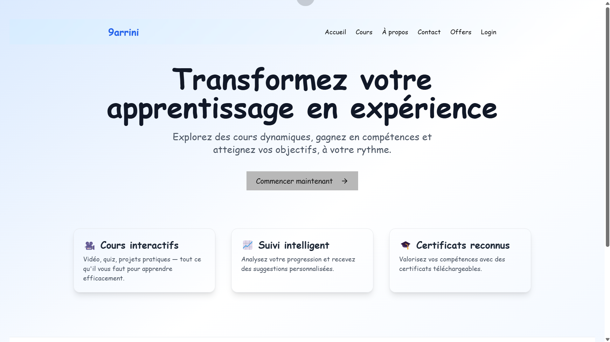
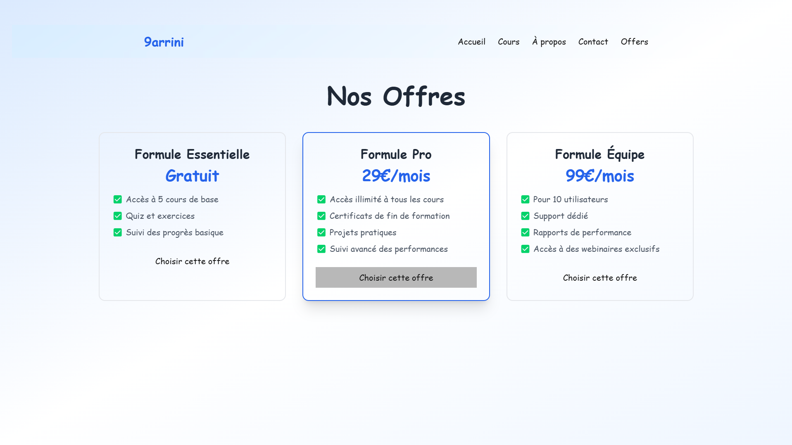
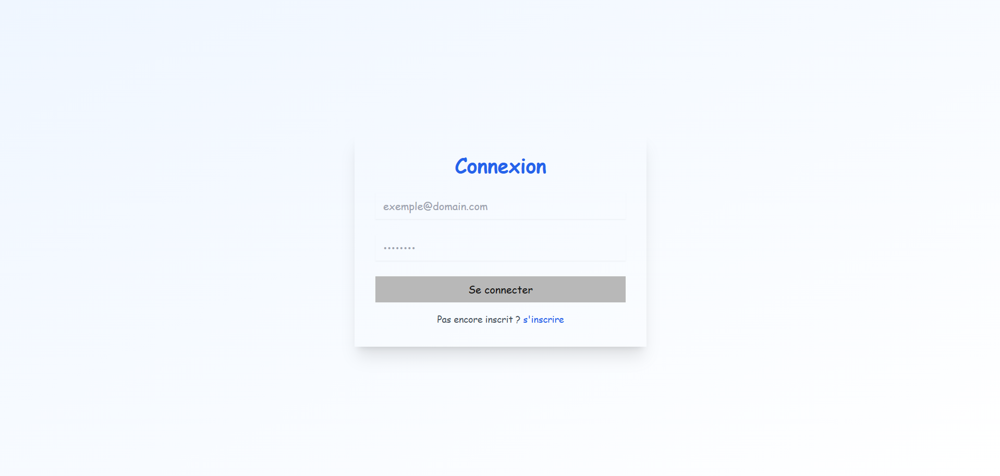

# 🎓 E-Learning Platform - 9arrini

Une plateforme moderne de formation en ligne, conçue avec React, NextUI, DaisyUI, Tailwind CSS, Vite et PHP pour le backend.

---

## 🚀 Fonctionnalités

- ✅ Page d'accueil professionnelle (landing page)
- 📚 Liste et détails des cours
- 🧾 Offres d'abonnement
- 👥 Authentification (inscription / connexion)
- 🧑‍🏫 Page À propos & Contact
- 📊 Tableau des utilisateurs
- 🔐 Pages privées à venir (dashboard, suivi de progression)

---

## 🛠️ Technologies utilisées

- **Frontend :**
  - React + Vite
  - Tailwind CSS
  - NextUI + DaisyUI
  - React Router DOM

- **Backend :**
  - PHP (prévu ou en cours de développement)

---

## 📂 Structure du projet

```
frontend/
├── src/
│   ├── pages/            # Toutes les pages React (Landing, Login, Cours, etc.)
│   ├── components/       # Composants réutilisables
│   ├── App.jsx           # Configuration des routes
│   └── main.jsx          # Entrée de l'app
├── public/
├── index.html
└── tailwind.config.js

backend/                  # (à ajouter pour l'API PHP)
```

---

## ▶️ Lancer le projet

### 🧪 Frontend

```bash
cd frontend
npm install
npm run dev
```

Accessible sur : `http://localhost:5173`

### 🧪 Backend (si présent)

```bash
cd backend
# Configuration PHP via XAMPP/WAMP ou serveur local
```

---

## 🧑‍💻 Auteur

- 👨‍💻 [Youssef Khalifa](https://github.com/youssefkhalifa04)

---

## 🌐 Aperçu

Voici un aperçu de la plateforme :

### 🎯 Page d'accueil


### 📚 Page des cours


### 🧾 Page des offres


### 🔐 Page de connexion


---

## 📌 À venir

- Intégration avec API PHP
- Gestion des utilisateurs
- Tableau de bord utilisateur
- Paiements et abonnements
- Notifications en temps réel

---

## 📄 Licence

MIT - Open source & libre d'utilisation
```

